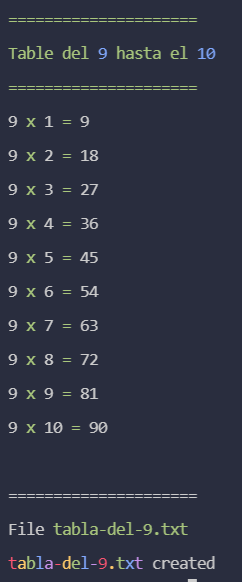

# Multiply app

```
Options:
      --help     Show help                                             [boolean]
      --version  Show version number                                   [boolean]
  -b, --base     Specify the base for multiply               [number] [required]
  -v, --verbose  Display the table on console         [boolean] [default: false]
  -l, --limit    Set the limit for the table              [number] [default: 10]
```

